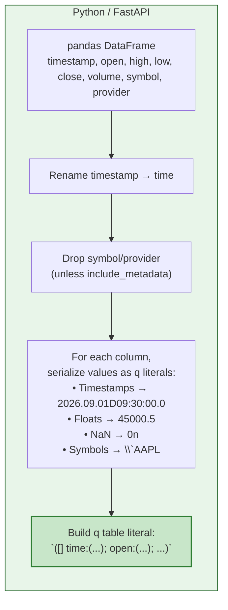

# achest.q — Visual Workflow

```mermaid
%%{init: {'theme': 'neutral', 'themeVariables': { 'fontSize': '14px', 'primaryColor': '#f0f0f0'}}}%%

flowchart TD
    subgraph User["👤 User's q Session"]
        direction TB
        A["`**\\l achest-kdb-q/achest.q**`"] --> B["`**tbl: .achest.fetch[\\`BTCUSDT; 2026.09.01; 2026.09.23; \\`minute]**`"]
    end

    subgraph Client["📦 achest.q (Pure q Client)"]
        direction TB
        C["**Startup Checks**<br/>• curl available?<br/>• Read DATA_API_TOKEN<br/>• Set BASE_URL"]
        D["**mkpayload()**<br/>Normalize symbols & dates<br/>→ JSON with `format`: `q`"]
        E["**curlpost()**<br/>`curl -s -X POST -d '{...}'`<br/>`https://achestv2.misango.me/v1/data`"]
        F["**value(raw)**<br/>Parse q table literal string<br/>→ Native q table"]
    end

    subgraph Server["⚙️ FastAPI Server (Python)"]
        direction TB
        G["**Route Symbol**<br/>Select best provider<br/>(Yahoo, Binance, Massive, etc.)"]
        H["**Fetch OHLCV**<br/>From upstream provider"]
        I["**Normalize**<br/>Standard columns:<br/>timestamp, open, high,<br/>low, close, volume"]
        J["**to_q_table()**<br/>timestamp → time<br/>Serialize as q literal:<br/>`([] time:(...); open:(...); ...)`"]
    end

    subgraph Result["📊 In Your q Session"]
        K["**tbl** is a native q table<br/><br/>```q\nmeta tbl\n// time  timestamp\n// open  float\n// high  float\n// low   float\n// close float\n// volume float\n```"]
    end

    A --> C
    C --> D
    B --> D
    D --> E
    E -->|HTTP POST| G
    G --> H
    H --> I
    I --> J
    J -->|HTTP 200<br/>q literal string| F
    F --> K

    style User fill:#e1f5fe,stroke:#01579b,color:#000
    style Client fill:#fff3e0,stroke:#e65100,color:#000
    style Server fill:#e8f5e9,stroke:#1b5e20,color:#000
    style Result fill:#f3e5f5,stroke:#4a148c,color:#000
```

## Step-by-Step Walkthrough

```mermaid
%%{init: {'theme': 'neutral', 'themeVariables': { 'fontSize': '13px'}}}%%

flowchart LR
    subgraph S1["① Load"]
        direction LR
        S1A["`**\\l achest.q**`"] --> S1B["Checks curl"]
        S1B --> S1C["Sets BASE_URL<br/>Reads token"]
    end

    subgraph S2["② Build Request"]
        direction LR
        S2A["**fetch()** parses<br/>symbols, dates, opts"] --> S2B["**mkpayload()**<br/>→ JSON with format=q"]
    end

    subgraph S3["③ HTTP"]
        direction LR
        S3A["**curlpost()**<br/>POST /v1/data"] --> S3B["**Server** fetches &<br/>normalizes data"]
        S3B --> S3C["**to_q_table()**<br/>→ q literal string"]
    end

    subgraph S4["④ Parse"]
        direction LR
        S4A["**value(raw)**<br/>evaluates q literal"] --> S4B["Native q table<br/>ready for analysis"]
    end

    S1C --> S2A
    S2B --> S3A
    S3C --> S4A

    style S1 fill:#e1f5fe,stroke:#01579b
    style S2 fill:#fff3e0,stroke:#e65100
    style S3 fill:#e8f5e9,stroke:#1b5e20
    style S4 fill:#f3e5f5,stroke:#4a148c
```



## Data Flow Detail

```mermaid
sequenceDiagram
    participant U as User (q)
    participant C as achest.q Client
    participant S as FastAPI Server
    participant P as Provider API

    U->>C: .achest.fetch[`BTCUSDT; ...; `minute]
    Note over C: mkpayload() → JSON with format="q"
    C->>S: POST /v1/data (symbols, dates, resolution, format=q)
    Note over S: Route symbol → select provider
    S->>P: Fetch OHLCV data
    P-->>S: Raw market data
    Note over S: Normalize → pandas DataFrame
    Note over S: to_q_table() → q literal string
    S-->>C: HTTP 200 (text/plain)
    Note over C: value(raw) → parse q literal
    C-->>U: Native q table (tbl)
    Note over U: Use it!<br/>select, aj, mavg, etc.
```

## Key Code Flow

```mermaid
flowchart TB
    subgraph Code["achest.q Execution Trace"]
        direction TB
        L1["`**fetch**`"] --> L2["`o: opts or default dict`"]
        L2 --> L3["`prov: o[\\`provider] or \\`auto`"]
        L3 --> L4["`token: o[\\`token] or env var`"]
        L4 --> L5["`raw: curlpost[mkpayload[...]; token]`"]
        L5 --> L6["`@[value; raw; error handler]`"]
        L6 --> L7["`→ Returns native q table`"]
    end

    style Code fill:#fafafa,stroke:#333,stroke-width:2px
    style L1 fill:#ffcc80
    style L7 fill:#a5d6a7
```

## Server-Side: `to_q_table()` Logic


